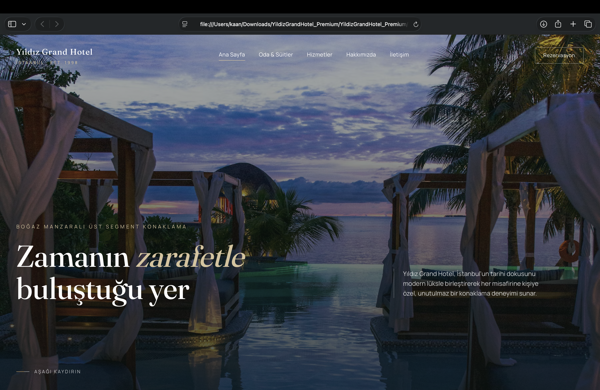
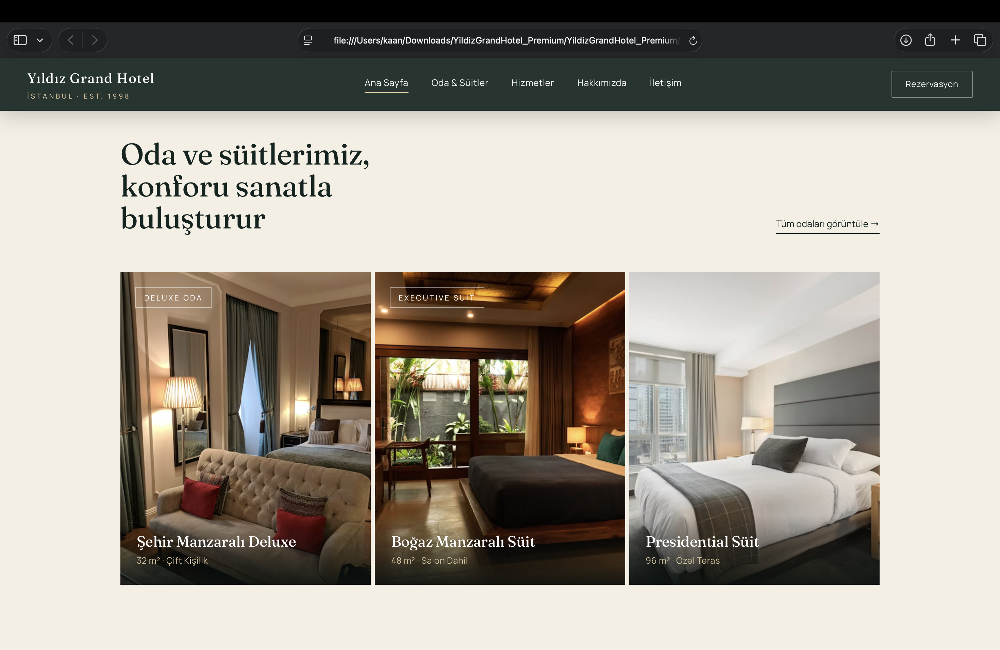
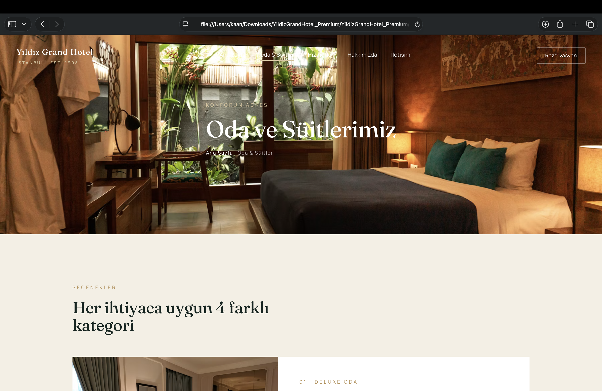
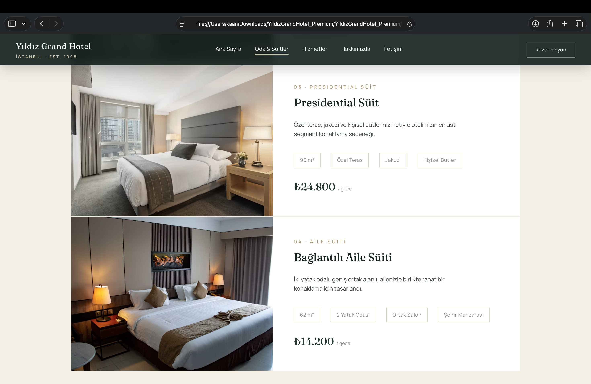
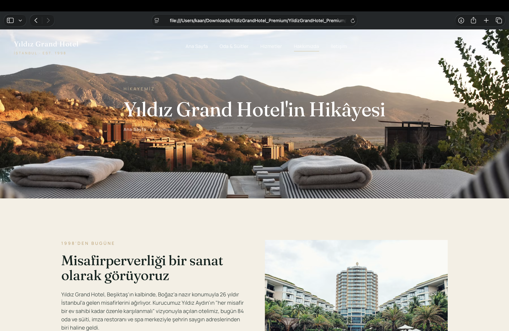

<div align="center">
  

  <h1>Yıldız Grand Hotel</h1>
  <p>A premium, multi-page hotel website with Bosphorus views — built with pure HTML & CSS.</p>

  <p>
    
    
    
  </p>
</div>

---

## ✨ Features

- A full 7-page hotel site: Home, About, Rooms & Suites, Reservation, Events, Contact, FAQ
- Elegant, modern design language with custom typography and gold/navy accents
- No frameworks, no dependencies — just open and it works
- Responsive page layouts

## 🖼️ Screenshots

### Home


### Rooms & Suites


### Room Detail


### Pricing


### About


## 📄 Pages

| Page | File |
|---|---|
| Home | `index.html` |
| About | `about.html` |
| Rooms & Suites | `odalar.html` |
| Reservation | `rezervasyon.html` |
| Events | `etkinlikler.html` |
| Contact | `iletisim.html` |
| FAQ | `sss.html` |

## 🚀 Getting Started

No build step required — just clone and open in your browser:

```bash
git clone https://github.com/kaandevs-ops/yildiz-grand-hotel-website.git
cd yildiz-grand-hotel-website
open index.html
```

## 📜 License

This project is licensed under the [Apache License 2.0](LICENSE).
